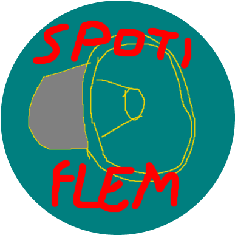

# Spotiflen

  

## ¿Qué es Spotiflen?

Spotiflen es uno de los desafíos de aprendizaje que permitirán profundizar sobre los conceptos del stack **MERN**.

## ¿Qué significa que el stack utilizado sea **MERN**?

En simples palabras, _el stack MERN_ es un conjunto de 4 _frameworks_/tecnologías utilizados para el desarrollo de aplicaciones web, específicamente _MongoDB, Express JS, React JS y Node JS_.

## Configuración de React

El FrontEnd del proyecto **para modo desarrollo** puede llevarse a cabo con el comando `yarn start`.\
En el caso del modo de producción, los archivos optimizados se obtienen con el comando `yarn build`

### `yarn start`

- Para iniciar la aplicación en modo desarrollo.
- Ir a [http://localhost:3000](http://localhost:3000) en el navegador para ver el proyecto.

- Al editar el código, **la página se recargará automáticamente**.
- Los errores que puedan existir se mostrarán en la terminal/consola.

### `yarn build`

- Crea los archivos para producción en la carpeta/directorio `build`.
- Esto junta correctamente los archivos de React y optimiza los archivos para obtener el mejor desempeño.

- La versión de producción estará _minificada_ y los nombres de los archivos irán con _hashes_.
- En ese momento la aplicación estará completada y lista para producción.